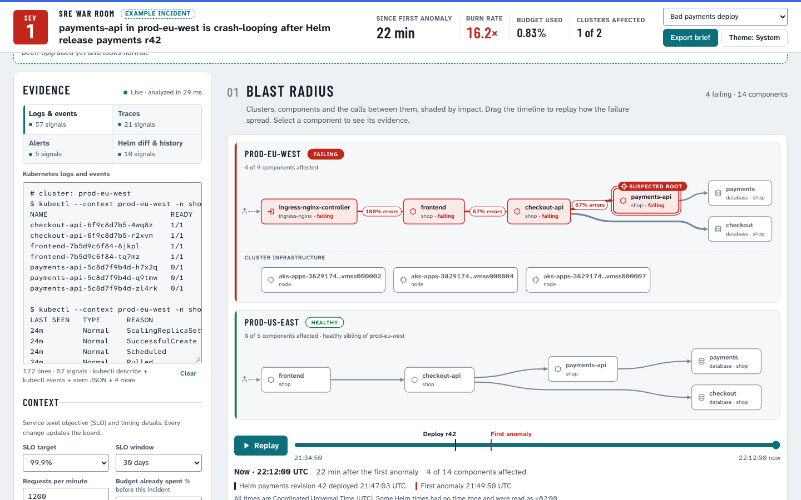

# SRE War Room

Paste Kubernetes logs, traces, alerts and Helm history into one page and get a live blast-radius map, ranked root causes with evidence, rollback commands, and an error-budget burn estimate. Everything runs in the browser. No server, nothing leaves your machine.

**Try it:** https://briantaylormd.github.io/sre-war-room/



**Who built it:** a physician's AI setup (Claude Code) built this in one afternoon, with tests and sourced figures. I'm not an SRE. I'd like to know where it holds up and where it doesn't.

## What you paste

- **Logs & events:** `kubectl logs`, `kubectl get events`, `kubectl get pods` or `describe pod` output. JSON, klog, logfmt and stern lines all work.
- **Traces:** OpenTelemetry (OTLP) JSON, Jaeger JSON, or one span per line.
- **Alerts:** an Alertmanager webhook payload, Prometheus `/api/v1/alerts` JSON, or `[FIRING]` lines.
- **Helm diff & history:** `helm history`, `helm list`, `helm diff upgrade`, or a unified diff of `values.yaml`.

One box is enough. The page recalculates as you type.

## What you get

- **Blast-radius map:** one lane per cluster, components and the calls between them shaded by impact, the suspected root ringed. A replay timeline shows the failure spreading.
- **Probable root causes:** ranked by confidence. Every piece of evidence jumps to the pasted line it came from.
- **Rollback options:** exact Helm and kubectl commands with time to recover, risk and caveats. Nothing runs by itself.
- **Error budget:** burn rate, budget used, time to exhaustion, and which multiwindow burn-rate alerts from the Google SRE Workbook would page.
- **Observability stacks:** Datadog, Grafana, OpenTelemetry and hosted cloud side by side, with where each would break down for this incident at your scale. Every figure links to its source.

Four example incidents are built in (bad deploy, DNS outage, expired certificate, database connection exhaustion).

## Investigate with Claude

The optional "Investigate with Claude" panel is a read-only, HolmesGPT-style second opinion. It only works when the page is hosted as a claude.ai Artifact, where it borrows the viewer's own Claude account. On any other host the panel is inert and everything else still works.

## Run it

Open the link above, or open `docs/index.html` from this repository in a browser. That one file is the whole app.

To rebuild from source (Node 20 or newer):

```
node build.mjs
node --test tests/
```

## Credit

The design borrows the investigate-then-ask-before-acting approach shown in the HolmesGPT keynote at KubeCon Europe 2026. The code here is original.

## License

MIT. See `LICENSE`.
